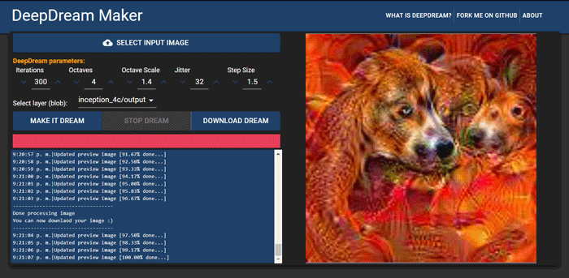

# DeepDream Maker

**DeepDream Maker** is a GUI Interface wrapper for [Google's Deep Dream](https://github.com/google/deepdream) and related python scripts

It allows you to easily dreamifty images without needing to use a terminal and provides a
flexible and intuitive way to customize your dreams by specifying different parameters

## Welcome DeepDream Maker v2.0

## WARNING: 
*DeepDream Maker version 2 is currently under development, you will running the development version of the app by following the instructions below.
This README will be updated with further instructions once the production version is ready.
What this means for you is that the app may crash under some circumstances and somethings may randomly break but we'll do our best to let you know if that happens as you are
using the app to create images.*

## Quickstart
**NOTE:** The only requirement is to have [Docker](https://www.docker.com/) and [Docker-compose](https://docs.docker.com/compose/) installed on your system!

Clone the repository:
`git clone https://github.com/OverStruck/deep-dream-maker.git`

Build the images: `docker-compose build`

Build run the services:
`docker-compose up` or `docker-compose up -d` if you don't want to see the terminal output

Alternativetely you can also build the images and run them at the same time:
`docker-compose up --build`

After the containers are running and fully initialized, you can go to `http://localhost:7777/` in your favorite web broswer and start making deep dream images! 😊

## Current state of the project
DeepDream maker has been updated from version 1 to version 2. This new version uses Docker & Docker Compose to allow for a seamless experience.
The app now runs as a web application, so you'll use your web broswer to dreamify images.

Happy dreaming!
