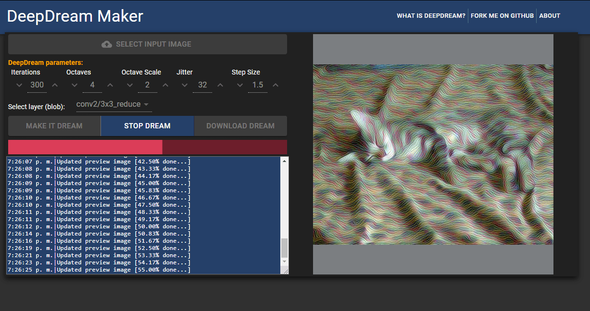

# DeepDream Maker

**DeepDream Maker** is a web application interface "wrapper" for [Google's Deep Dream](https://github.com/google/deepdream).

It allows you to easily dreamifty images without needing to use a terminal or install dependencies like caffe and provides a flexible and intuitive way to customize your dreams by specifying different parameters.

## Welcome DeepDream Maker v2.0

## Quickstart
**NOTE:** The only requirement is to have [Docker](https://www.docker.com/) and [Docker-compose](https://docs.docker.com/compose/) installed on your system!

1. Clone the repository:
`git clone https://github.com/OverStruck/deep-dream-maker.git`
2. Navigate to the deep-dream-maker folder: `cd deep-dream-maker/`
3. Build the images: `docker-compose build`
4. Run the services/containers:
`docker-compose up` or `docker-compose up -d` if you don't want to see the terminal output

Alternatively you can also *just* build the images and run them at the same time:
`docker-compose up --build -d`

After the containers are running and fully initialized, you can go to `http://localhost:9993/` in your favorite web browser and start making deep dream images! 😊

## Current state of the project
DeepDream maker has been updated from version 1 to version 2. This new version uses Docker & Docker Compose to allow for a seamless experience.
The project is still in very active development. And *something* may break. If you encounter any issues, feel free to open up an issue. 

## Contributing
ALL contributions are welcome, if you'd like to contribute, please see our [contributing guide](docs/CONTRIBUTING.md).

Instructions on how to run the development version can be found [here ](docs/development-guide.md).

Happy dreaming!
